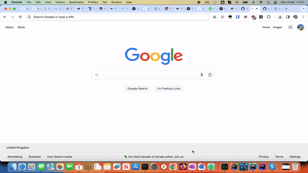
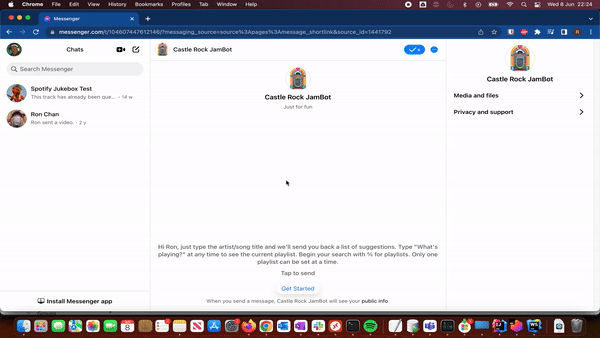

# Spotify Jukebox

This is a real-time updating Spotify visualizer/controller.

It has been modified from the [original project](https://github.com/busybox11/NowPlaying-for-Spotify)
to allow playback on other devices (eg. if it's playing from a phone or the Spotify app on a different computer)
as well as the ability to add songs to the current play queue.

The intention of this project is so that it can be deployed at parties or large events/venues (eg. cafes, pubs, etc..).
Publish the URL so that guests are able to queue additional songs from their phone (while playback occurs on a master
device hooked up to some speakers).
You may not want guests to skip tracks or toggle pause/play so that access is configurable but they'll be able to see
what's currently playing (and what's currently queued).

You can also interface with the "JukeBot" via (Facebook) Messenger.

This project is licensed under GNU GPL-3.0 license.

---


[](screenshots/demo.mp4)

###### tip to me: [paypal.me/ronchan44](https://paypal.me/ronchan44) (thank you!)

## **Spotify Jukebox Changelog**

v1.2
- merged facebook messenger bot support with blacklisting of users/tracks from https://github.com/sirstudly/SpotifyJukebox

v1.1
- Rewrite backend to NodeJS
- Listen to WSS change notifications so we don't need to poll Spotify servers every second
- Removed Spotify SDK from front-end client
- Streamlined token retrieval on startup
- Show more than one song in the "Up next" list
- Persist auth tokens so it will survive a server restart
- Default to currently active device (otherwise use preferred device)
- Prevent duplicate songs from being queued
- Find a way to uniquely identify users so they can be blacklisted
- Show volume slider on overlay
- Show lyrics (in dialog)

v1.0
- Initial version forked from NowPlaying repo
- Added queue song functionality to playing.php 
- Added backend Spotify API support in spotify.php
- Removed need for Spotify API key from front-end client

## **Upcoming changes**

- [ ] Show more than 20 tracks when searching 
- [ ] Setup WSS server and push out notifications rather than poll every second
- [ ] Prevent songs matching keywords from being queued, eg. "farts"
- [ ] Implement blacklist by sessionID

## **What modifications are required?**

You should have a declared app in Spotify's developer dashboard to obtain a `Client ID`.

*How to do this:*
As I said, the first thing is to create a Client ID (`Create a Client ID` button) on [Spotify's developer dashboard](https://developer.spotify.com/dashboard/applications).
Type your app's name in the `App or Hardware name` text field, and its description on the `App or Hardware description` text field. In the `What are you building ?` section, indicate the platform which you are building the app for, then click on the `NEXT` button. Answer to the commercial integration question, and continue. If necessary, fill the form and check all the boxes at the 3rd stage and you're ready to go. Your app is declared in Spotify's developer dashboard!

Now that you have your app, you have some modifications to do in one file: `.env`.
(If it doesn't exist, copy `example.env` to `.env`)

Edit those values:

- `CLIENT_ID` by your Spotify Client ID available on your app's panel,
- `CLIENT_SECRET` by your Spotify `Client Secret` available by clicking on the `Show Client Secret` button situated on the same webpage as your client ID,
- `PORT` by the default port this server will listen on for requests
- `REDIRECT_URI` by your redirect URL to handle the exchange of a Spotify access code to an access token. This will be the host on which this project is deployed on followed by `/spotify`. Note: You'll also need to add this redirect URL to your App in your [Spotify Dashboard](https://developer.spotify.com/dashboard).
- `PREFERRED_DEVICE_ID` (optional) by your preferred Spotify device ID to resume playback to if nothing is playing. Some devices don't support this. Use the `/get-devices` endpoint to find your device ID.
- `SPOTIFY_FALLBACK_PLAYLIST_URI` by a playlist URI that will fallback if nothing is playing (requied when a song is queued)
- `MESSENGER_VERIFY_TOKEN` by a random string used to verify your FB messenger endpoint is working correctly
- `MESSENGER_ACCESS_TOKEN` by your secret access token for your meseenger app. You can create one at https://developers.facebook.com/apps/
- `SHOW_PLAYBACK_CONTROLS` set to `true` to show play/pause/skip track buttons overlay
- `USER_BLACKLIST` by a comma delimited list of fb users that have been blacklisted
- `TRACK_BLACKLIST_REGEX` by a regex expression that disallows any matching track names from being queued

Let's go back on our app's panel. You need to declare the URL where Spotify will redirect after initial authentication. For a local hosting it would be in most cases `http://localhost:3000/spotify`. Click on the green `Edit settings` button situated on the top of the page, then in the `Redirect URIs` text field, indicate yours. ***ATTENTION***: what you typed should **IMPERATIVELY** be the same as what you wrote above! Then click on the `SAVE` button on the very bottom of the form. Your app is declared and ready to use!

Upon startup, we'll need to get the initial access/refresh tokens from Spotify. We'll also need an elevated web-based token so we can register for change events.
You'll be redirected first to the Spotify consent page where you'll be requested to login to your Spotify account.
Once that is complete, there will be a following step to grab the session cookie for the web player. Instructions are on the page.

## Facebook Messenger Bot

If you also want to host a (facebook) messenger bot, you'll also need to create a messenger app.
Step by step instructions can be found here: [https://medium.com/p/70c863337331](https://medium.com/p/70c863337331)
* Login to https://developers.facebook.com/apps/
* Update the `MESSENGER_ACCESS_TOKEN` with the one from your app in your `.env` file
* Under Messenger, Settings -> Update Webhooks. Enter the publicly accessible host where this project is deployed followed by `/webhook`.  Verify token is an agreed upon token you make up in `MESSENGER_VERIFY_TOKEN`.
* Verify and save
* Send the following POST request to setup the initial conversation when someone messages the bot:
```
curl -X POST \
  'https://graph.facebook.com/v9.0/me/messenger_profile?access_token=<FILL IN ACCESS TOKEN HERE>' \
  -H 'Content-Type: application/json' \
  -d '{
    "get_started": {
        "payload": "{\"command\": \"GET_STARTED\"}"
    },
    "greeting": [
        {
            "locale": "default",
            "text": "Hi {{user_first_name}}, just type the artist/song title and we'll send you back a list of suggestions. Type \"What's playing?\" at any time to see the current playlist.\nBegin your search with % for playlists. Only one playlist can be set at any time.\nSee also https://jambot.castlerockedinburgh.com/"
        }
    ],
    "home_url": "https://jambot.castlerockedinburgh.com/",
    "persistent_menu": [
        {
            "locale": "default",
            "call_to_actions": [
                {
                    "type": "postback",
                    "title": "What'\''s playing?",
                    "payload": "{\"command\": \"STATUS\"}"
                }
            ]
        }
    ]
}'
```

[](screenshots/fbdemo.mp4)

## **Credits**
This project is directly forked from [NowPlaying for Spotify by Busybox11](https://github.com/busybox11/NowPlaying-for-Spotify)
and [Spotify Jukebox by Alex Kitching](https://github.com/alexkitch/SpotifyJukebox).
- [spotify-web-api-node by Michael Thelin](https://github.com/thelinmichael/spotify-web-api-node)
- [How To Build a Spotify Jukebox Using a Facebook Messenger Bot in Node.js](https://medium.com/p/70c863337331)

## **Featured similar projects / forks**
- [NowPlaying Dashboard for Spotify by @peterdconradie](https://github.com/peterdconradie/Now-Playing-Dashboard-for-Spotify)
- [MPRIS electron app by @AryToNeX](https://github.com/AryToNeX/nowplaying-electron)
