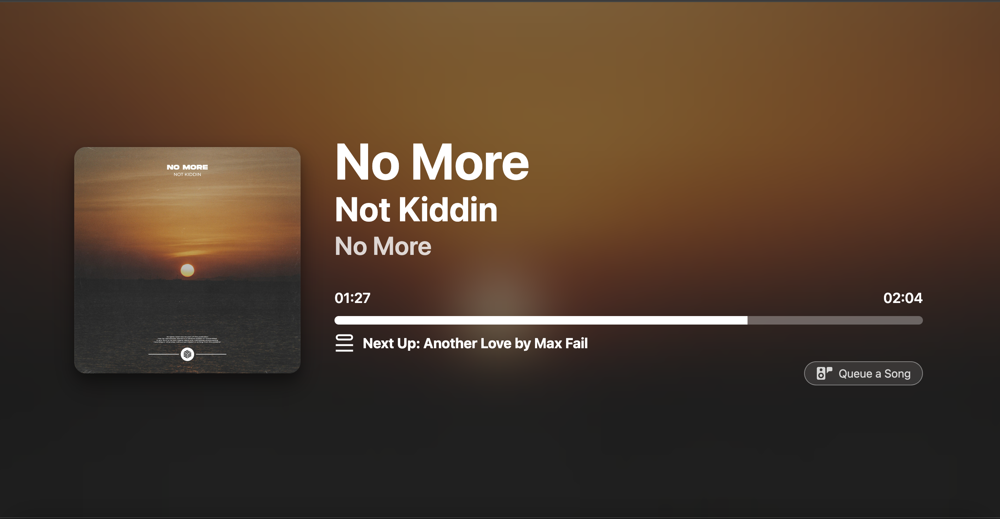
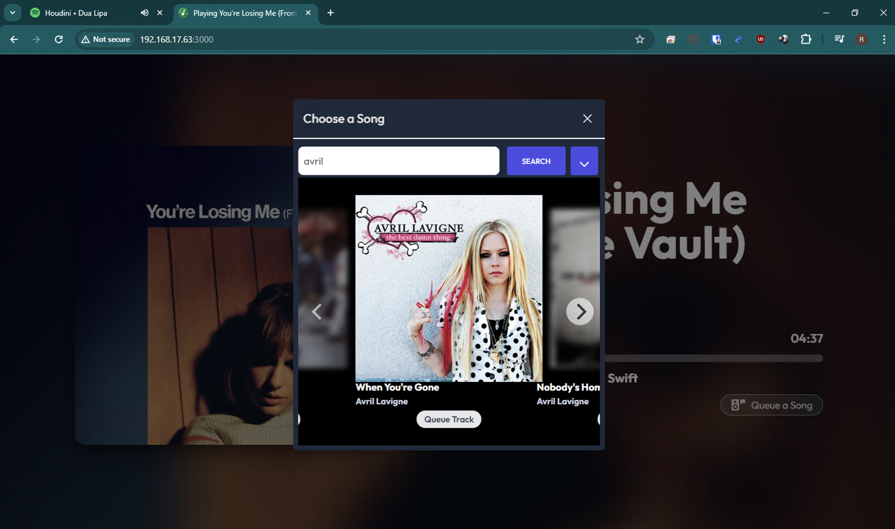

# Spotify Jukebox

This is a real-time updating Spotify visualizer/controller.

It has been modified from the [original project](https://github.com/busybox11/NowPlaying-for-Spotify)
to allow playback on other devices (eg. if it's playing from a phone or the Spotify app on a different computer)
as well as the ability to add songs to the current play queue.

The intention of this project is so that it can be deployed at parties or large events/venues (eg. cafes, pubs, etc..).
Publish the URL so that guests are able to queue additional songs from their phone (while playback occurs on a master
device hooked up to some speakers).
You may not want guests to skip tracks or toggle pause/play so that access is configurable but they'll be able to see
what's currently playing (and what's currently queued).

Also check out [my other project](https://github.com/sirstudly/SpotifyJukebox) which is essentially the same thing, 
but implemented as a (Facebook) Messenger bot.

This project is licensed under GNU GPL-3.0 license.

---





###### tip to me: [paypal.me/ronchan44](https://paypal.me/ronchan44) (thank you!)

## **Spotify Jukebox Changelog**

v1.0
- Initial version forked from NowPlaying repo
- Added queue song functionality to playing.php 
- Added backend Spotify API support in spotify.php
- Removed need for Spotify API key from front-end client

## **Upcoming changes**

- [X] ~~Move player controls into backend API (spotify.php) so we don't need to publish the API key~~
- [ ] Remove Spotify SDK javascript library entirely so we don't publish any key
- [ ] Show more than one song in the "Up next" list
- [ ] Is it possible to use WSS to monitor the DEVICE_STATE_CHANGE event from non-local players rather than poll every second?
- [ ] Add ability to set playlist, set album, set artist radio, etc...
- [ ] Set shuffle mode, repeat, etc.
- [X] ~~How to handle token expiry? Server side tokens need to be refreshed (and saved)~~

## **NowPlaying Changelog**

v2.0.X

- Rewrite with TailwindCSS and AlpineJS
- Improve performance
- Fix blur edges
- Fix Safari hardware acceleration
- No full page reload for reauthentication
- Mini player usage and generation

<details>
  <summary>v1.6.X</summary>

    - Use of localStorage
    - Added GNU GPL-3.0 license
    - Updated Index page design
    - Updated French and English sentences
    - Compatibility with Dark Reader
    - Better UI consistency / CSS tweaks
    - More languages
    - .env support (thanks @finnie2006!)
</details>

<details>
  <summary>v1.5.X</summary>

    - Added playback support (Premium account should be needed)
    - Added playback information
    - Added pause button (#17)
    - CSS improvements added for better responsive (#15 #16)
    - SEO improvements (#16)
    - Minor CSS improvements
</details>

<details>
  <summary>v1.4.X</summary>

    - Advertisements are recognized
    - Multiple artists are recognized
    - Experimental theme switcher
</details>

<details>
  <summary>v1.3.X</summary>

    - Now playing device name and type is showing
    - Cursor is hidden after a couple of seconds
    - Fullscreen button
</details>

## **Made with**

HTML, TailwindCSS, JS / AlpineJS, PHP

## **Used libraries:**

[Spotify Web API PHP by jwilsson](https://github.com/jwilsson/spotify-web-api-php) to obtain the token and refresh token,
[Spotify Web API JS by JMPerez](https://github.com/jmperez/spotify-web-api-js) to retrieve and display the currently playing song

## **Known bugs**

- [ ] Podcasts aren't recognized
- [X] ~~White flash when loading new artwork~~

## **Upcoming changes**

- [ ] Floating window (PiP)
- [X] ~~Rewrite (see [discussion #76](https://github.com/busybox11/NowPlaying-for-Spotify/discussions/76) about the possible use of web frameworks)~~
- [X] ~~OBS source (Done since [v2.1](https://github.com/busybox11/NowPlaying-for-Spotify/commit/994c52e06881f78f52b4a151fec11376db3edf12))~~
- [ ] Local players support (coming with [localmusic-api](https://github.com/busybox11/localmusic-api/projects) - [Sunamu by @NyaomiDEV](https://github.com/NyaomiDEV/Sunamu))
- [X] ~~Better config handling (e.g. automatic deployment, **HELP WANTED!**)~~
- [ ] Themes

## **Feature ideas**

- Chromecast integration
- Analytics panel

## **How to host this?**

You can use XAMPP (multi-platform) or Wampserver (Windows only) but any webserver with PHP 7.0 or greater is good to use, with the `php-curl` module.

**!!! If you are on Nginx you need to add this to your config, or else your .env will be exposed to the internet !!!**
```
location /.env {
    allow [YourIP]; # Allow your IP if you want to, if not delete this line.
    deny all;
}
```

## **What modifications are required?**

You should have a declared app in Spotify's developer dashboard to obtain a `Client ID`.

*How to do this:*
As I said, the first thing is to create a Client ID (`Create a Client ID` button) on [Spotify's developer dashboard](https://developer.spotify.com/dashboard/applications).
Type your app's name in the `App or Hardware name` text field, and its description on the `App or Hardware description` text field. In the `What are you building ?` section, indicate the platform which you are building the app for, then click on the `NEXT` button. Answer to the commercial integration question, and continue. If necessary, fill the form and check all the boxes at the 3rd stage and you're ready to go. Your app is declared in Spotify's developer dashboard!

Now that you have your app, you have some modifications to do in one file: `.env`.
(If it doesn't exist, copy `example.env` to `.env`)

Edit those values:

- `YOUR_CLIENT_ID` by your Client ID available on your app's panel,
- `YOUR_CLIENT_SECRET` by your `Client Secret` available by clicking on the `Show Client Secret` button situated on the same webpage as your client ID,
- `YOUR_DOMAIN` by your redirect URL, in the case of a local hosting replace it by `http://localhost/token.php` in most cases. Basicaly, it's the accessible URL for the `tokens.php` page. Note: You'll also need to add this redirect URL to your App in your [Spotify Dashboard](https://developer.spotify.com/dashboard).
- `TOKEN_FILE` by the name of the file to hold your Spotify access and refresh tokens
- `SHOW_PLAYBACK_CONTROLS` set to `true` to show play/pause/skip track buttons overlay

Let's go back on our app's panel. You need to declare the URL where the `token.php` page is located, for a local hosting it would be in most cases `http://localhost/token.php`. Click on the green `Edit settings` button situated on the top of the page, then in the `Redirect URIs` text field, indicate yours. ***ATTENTION***: what you typed should **IMPERATIVELY** be the same as what you wrote in the two precedent files! Then click on the `SAVE` button on the very bottom of the form. Your app is declared and ready to use!

Now we'll need to generate the initial access/refresh tokens attached to your Spotify account. You only need to do this once.
This is the file defined by `TOKEN_FILE` in your `.env` file. Go to `http://localhost/tokens.php` (or wherever you're deployed) in your web browser.
Click on the appropriate Spotify button to be redirected to the Spotify consent page and click Agree. The `TOKEN_FILE` should now be updated with the access/refresh tokens required to access the Spotify API.

## **Credits**
This project is directly forked from [NowPlaying for Spotify by Busybox11](https://github.com/busybox11/NowPlaying-for-Spotify)

Flags by [Freepik](https://www.freepik.com/) of the [www.flaticon.com](https://www.flaticon.com/) website under [Creative Commons BY 3.0](http://creativecommons.org/licenses/by/3.0/) license.

## **Featured similar projects / forks**
- [NowPlaying Dashboard for Spotify by @peterdconradie](https://github.com/peterdconradie/Now-Playing-Dashboard-for-Spotify)
- [MPRIS electron app by @AryToNeX](https://github.com/AryToNeX/nowplaying-electron)
